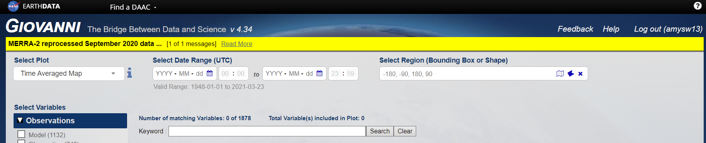
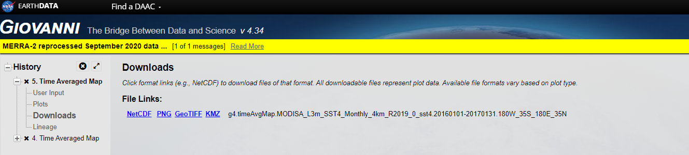

## Part A: Mapping temperature anomalies

- Creating function for GIVOANNI data
  - loading
  - reading
  - formatting
  
- Calculating temperature anomalies
  - Long-term vs. single year sea surface temperature datasets
  
- Creating themes for ggplot
  
- Mapping temperature anomalies 
  - Editing maps with ggplot 

---

## Housekeeping

Clear memory and global environment

```{r}
rm(list=ls())
```

- This is useful when utilising large datasets

  - Be aware to save files/graphs/maps during open sessions if required for future use

---

## Packages

Load required packages

 - Below is an example of code which is useful when sharing with new users
 - Allows new users to check if they have the package before installing and loading

```{r message=FALSE,}
if(!require(dplyr)){install.packages("dplyr"); library(dplyr)}
if(!require(ggplot2)){install.packages("ggplot2"); library(ggplot2)}
if(!require(tidyr)){install.packages("tidyr"); library(tidyr)}
if(!require(scales)){install.packages("scales"); library(scales)}
if(!require(RNetCDF)){install.packages("RNetCDF"); library(RNetCDF)} #to read in .nc files
if(!require(patchwork)){install.packages("patchwork"); library(patchwork)}
if(!require(maps)){install.packages("maps"); library(maps)}
if(!require(rnaturalearth)){install.packages("rnaturalearth"); library(rnaturalearth)}
if(!require(sf)){install.packages("sf"); library(sf)}
```


*Tip:* **Ctrl + Shift + Alt + M** *will select all occurrences of the same code in scope*

---

class: inverse, middle, center

# GIOVANNI data 

---

## Creating function to load GIOVANNI files

*Part 1:*

Here we are creating a custom function to load in GIOVANNI data.

- Creating a function called **"read_giovanni_nc_map"**
- Open function
- Loading and reading the data

```{r echo=F}
#this doesn't show up in the slide! But is split below
read_giovanni_nc_map <- function(giovanni_nc_map_file){ 

  #Load the NetCDF file
  giovanni_map_data <- open.nc(giovanni_nc_map_file)
  
  #Extract its content
  giovanni_map_data <- read.nc(giovanni_map_data)
  
  #Convert its content to a data frame
  giovanni_map_dataframe <- as.data.frame(giovanni_map_data[1])
  names(giovanni_map_dataframe) <- giovanni_map_data[["lat"]] 
  giovanni_map_dataframe$lon <- giovanni_map_data[["lon"]]

  #Switch from a wide matrix format
  #in which values for longitude are given across columns
  #to a long format, with a single temperature measurement per row
  giovanni_map_data <- gather(giovanni_map_dataframe,
                              "lat","temperature",
                              -length(names(giovanni_map_dataframe)))
  
  return(giovanni_map_data)
}
```

```{r eval=F}
read_giovanni_nc_map <- function(giovanni_nc_map_file){ #<<
  #Load the NetCDF file
  giovanni_map_data <- open.nc(giovanni_nc_map_file)
  #Read and extract its content
  giovanni_map_data <- read.nc(giovanni_map_data)
```

---

## Creating function to load GIOVANNI files

*Part 2:*

- Convert its content to a data frame and extract only required information

  - Temperature
  - Latitude
  - Longitude 

```{r eval=F}
#converting data to dataframe and loading in temperature data
  giovanni_map_dataframe <- as.data.frame(giovanni_map_data[1])
#loading in the latitude data
  names(giovanni_map_dataframe) <- giovanni_map_data[["lat"]]
#loading in the longitute data
  giovanni_map_dataframe$lon <- giovanni_map_data[["lon"]]
```

---

## Creating function to load GIOVANNI files

*Part 3:*

- Switch from a wide matrix format in which values for longitude are given across columns to a long format, with a single temperature measurement per row

  - see *?gather* for more details on this function

- Ensure the data is returned 
- Close the function

```{r eval=F}


  giovanni_map_data <- gather(giovanni_map_dataframe,
                              "lat","temperature",
                              -length(names(giovanni_map_dataframe)))
  
  return(giovanni_map_data) #<<
} #<<
```

---

##  GIOVANNI file names

Original GIOVANNI file names are extremely long. 

Examples: 

"g4.timeAvgMap.MODISA_L3m_SST4_Monthly_4km_R2019_0_sst4.**20020701-20210131**.180W_35S_180E_35N.nc"


  - Can see that within this file name the date is included, the above is from **01/07/2002 to 31/01/2021**


"g4.timeAvgMap.MODISA_L3m_SST4_Monthly_4km_R2019_0_sst4.**20160101-20170131**.180W_35S_180E_35N.nc"

  - This file is from **01/01/2016 to 31/01/2017**

Rename files to appropriately.

**Tip: Keep a folder of original data and name, just in case**

---

## The GIOVANNI data download page 

Accessing data from GIOVANNI
<div class="centered">
```{r, out.width="80%", out.height="45%", echo=FALSE, }



```
</div>

Downloading requested data from GIVOANNI

<div class="centered">
```{r, out.width="80%", out.height="45%", echo=FALSE}



```
</div>

---

class: inverse, middle, center

# Calculating temperature anomalies 

---

## Climatic averaged data

- Use custom function created earlier to read in long-term SST data

 - Change the file name in the script to match the file name downloaded from GIOVANNI or to the name you saved in your workspace/folder
 
    - Here the file name is *"long_term_SST4.nc"*

    - This will ensure that the metadata held in the filename are kept.

**Note: This data is the climatic averaged data** 

```{r warning=FALSE}
#this data is from 2002 to 2021 
climatic_average <-read_giovanni_nc_map("./Data/long_term_SST4.nc")

climatic_average <- rename(climatic_average,
                           climatic_temperature = temperature)

```

---

##  Single year/month data

- Apply the function to single year data

  - The year chosen should encompass a period of known coral bleaching

- Again, change file name as needed

```{r warning=FALSE}
#this is the chosen year/12 month time span of bleaching
single_year <- read_giovanni_nc_map("./Data/SST4_2016_2017.nc")

single_year <- rename(single_year,
                      year_temperature = temperature)
```

---

## Wrangling the data

- Creating a new object called *"anomaly"* and inputting the *"single_year"* dataframe

- Adding the *"climatic_average"* temperature data to the anomaly dataframe

```{r}
anomaly <- single_year

anomaly$climatic_temperature <- climatic_average$climatic_temperature
```

-  Calculate the anomalies (differences in temperature)

```{r}
anomaly$difference <- with(anomaly, year_temperature-climatic_temperature)
```

- Remove missing values

```{r}
anomaly <- na.omit(anomaly)
```

---

## Constrain the data to sensible values

- Select data that falls within **+** and **-** values of temperature difference

  - *Tip: Check your data to determine sensible data ranges to keep*
  
- Creating into a new dataframe, should we need to change any selection from the original dataframe

```{r}
temp_anomaly <- anomaly[anomaly$difference < 3 & anomaly$difference > -3,]
```

---

class: inverse, middle, center

# Setting the theme 

---

## Set the theme for plotting/mapping

.pull-left[
Example plot

```{r fig.width=5, fig.height=3}
p_original <- ggplot(mtcars, aes(mpg, wt)) +
              geom_point()

p_original
```
]

.pull-right[
Change theme

```{r fig.width=5, fig.height=3, fig.align='center'}
p_bw_theme <- p_original + theme_bw()
  
p_bw_theme
```
]

---

## Creating custom theme functions

Using **function()** can create custom themes to be applied to all plots or maps


```{r}
theme_map <- function () {
  theme_minimal()+
  theme(legend.position="right",
        plot.title = element_text(face = "bold", size = 14, hjust = 0.5),
        plot.margin = unit(c(0,0,0,0), "cm"),
        panel.grid.major = element_line(linetype = "dotted",
                                        colour = "grey50", size = .25),
        panel.background = element_rect(fill = "#acd5e8")) 
}

```

---

## Set theme for all other plots

```{r eval=FALSE}
theme_set(theme_map())
```
OR
```{r eval=FALSE}
theme_set(theme_bw())
```


```{r fig.width=6, fig.height=3}
p_original + p_bw_theme
```

- see http://docs.ggplot2.org/dev/vignettes/themes.html for other theme options

---
class: inverse, middle, center

# Mapping

---

## Downloading world base map

Using the **"rnaturalearth"** package we will download a world map

- Downloading data from naturalearth, will show a message of details of file you have downloaded  

- See *?ne_download* for more information on types of data you can download and more

```{r message=FALSE, warning=FALSE}
world <- ne_download( scale = 110, type = 'countries', returnclass = "sf")
```

---

## Check the world map

```{r , fig.height=5, fig.width=10, fig.align='center'}

ggplot()+
  geom_sf(data = world)

```

---


## Mapping temperature anomaly data 

Creating a map of temperature anomalies across the world

 - When mapping think about the necessary information required
 
    Example: 
    - graticules vs. scale bars and north arrows
    - legend scales
    - appropriate colour palettes
    
```{r}

p_map <- ggplot()+
          geom_tile(data = temp_anomaly, aes( #<<
                    x = as.numeric(lon),
                    y = as.numeric(lat),
                    fill = as.numeric(difference)))+
          geom_sf(data = world,
                  colour = "gray50",
                  fill = "gray50" )
```

---

## Unedited Map

Maps can take some time to print so have some patience here... 

```{r Unedited map, fig.height=5, fig.width=10, fig.align='center'}
print(p_map)
```

---

## Edit map 

Choose an appropriate colour palette to plot map

  - Here we want a diverging colour palette
  
  - https://rawgit.com/kwstat/pals/master/vignettes/pals_examples.html
  - https://www.youtube.com/watch?v=o9KxYxROSgM
  
  - We will use the **"pals"** package for a colour palette

```{r}
### install.packages("remotes")    
### remotes::install_github("kwstat/pals")  

library(pals)  

```

---

## Edit map details

Using ggplot as a mapping tool allows for high levels of customisation

 - Below represents just some of the features in which you are able to customise your map
 
 

```{r}

p_edited <- p_map +
            scale_fill_gradientn("Title of legend",
                                colours = ocean.curl(100))+
            xlab("X Title") + ylab("Y Title") +
            coord_sf(xlim = c(-180,180), ylim = c(-35,35), expand = FALSE)+
            scale_y_continuous(breaks = c(-30, -20 , -10, 0, 10, 20, 30))+ 
            theme(axis.ticks = element_line(colour = "red"),
                  axis.text = element_text(colour = "green"))
```

---

## Edited map 

```{r  fig.width=8, fig.height=4.5, fig.align='center'}

print(p_edited)

```

See links for more mapping info and guides

- https://www.r-spatial.org/r/2018/10/25/ggplot2-sf.html
- https://geocompr.robinlovelace.net/adv-map.html

---

## Save map and data

- Save the map to a png file, can also use this function to save as PDF or jpg 

- Change file name

  *Tip: Use ```?ggsave``` to see other formats which maps and plots can be saved*

```{r eval=FALSE}

ggsave("./Maps/Example_anomaly_map.png", p_edited, 
       bg = "transparent", width = 17, height = 12, 
       units =  "cm", dpi = 300)
```

- Save the data as a csv for analysis in other software of future use

 - remember to name the file appropriately for future reference

```{r eval=FALSE}
write.csv(temp_anomaly, file = "./Output/long_term_anomaly.csv")
```

---

## Advanced mapping 

Creating maps and beautiful figures for reports can be done with some advanced programming 

Uses

 - Site maps
 - Regional maps
 - Comparing different areas 
 
Types

  - inset maps
    - https://geocompr.github.io/post/2019/ggplot2-inset-maps/
    - https://upgo.lab.mcgill.ca/2019/12/13/making-beautiful-maps/
  
  - adding plots/maps to create simple to complex layouts 
    - https://patchwork.data-imaginist.com/articles/patchwork.html
  

